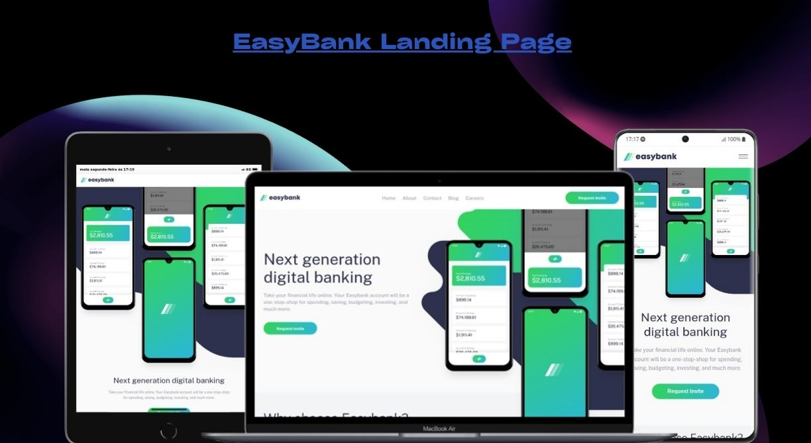

<h1 align="center">Frontend Mentor - Easybank landing page</h1>
<div align="center">
  <a href="#descrição">Descrição</a> |
  <a href="#iniciar">Iniciar</a> |
  <a href="#licença">Licença</a>
</div>

<p align="center">
  
</p>
<p>
 
</p>

## Descrição

A landing page é um site de uma empresa de financias, a aplicação e uma pagina única, sem muitas interações, contudo visando dar, uma boa experiencia para o usuário.

Na sua criação fora usado: [nextjs](https://nextjs.org/) com app router, css module para ajudar a separar/modularizar tantos os components quanto os estilos, fora usando também libs de animações como [motion](https://motion.dev/) e [react-multi-carousel](https://www.npmjs.com/package/react-multi-carousel).

Acesse o site **[EasyBank Landing Page](https://easybank-landing-page-chi-rust.vercel.app/)**.

## Iniciar

E Necessário ter o Nodejs e o git instalado.

Faça clone do repositório localmente.

```bash
git clone https://github.com/matheus369k/easybank-landing-page.git
cd ./easybank-landing-page
```

Instale as dependências

```bash
yarn
```

Agora você pode iniciar o projetos

```bash
yarn dev
```

## Licença

Licença usada **[MIT](./LICENSE.txt)**
